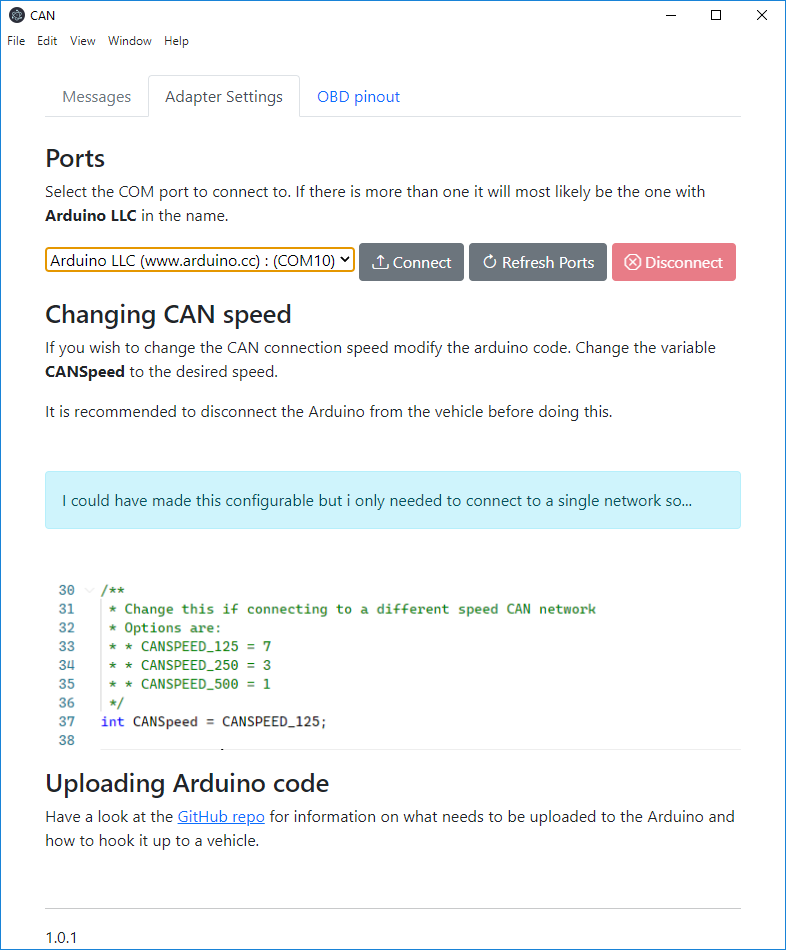
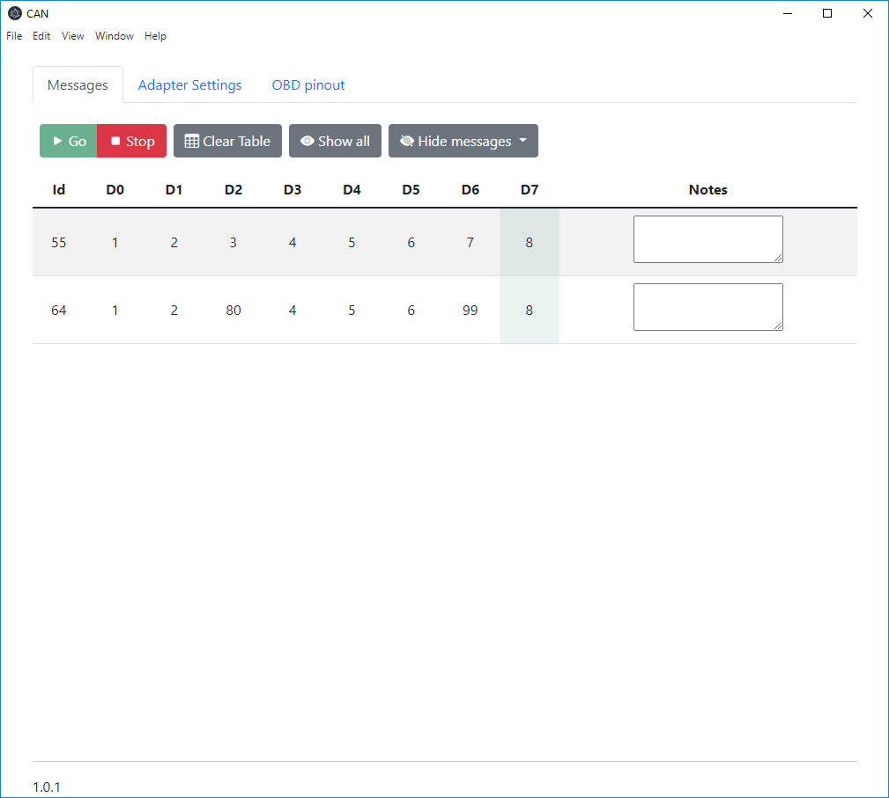

# Electron CAN Viewer

A very simple Electron based viewer of CAN bus network messages. It uses a simple Arduino based adapter to talk to the network. The Arduino communicates with Electron via a serial connection.

## Installation of the Electron app

Download the latest release from the [Releases page](https://github.com/ste2425/Electron-CAN-viewer/releases). You may recieve warnings during download and installation as i havent signed it. If you feel more comfortable you can clone the repo and run it from source.

## Configuring the Arduino

Information on the Arduino side of things is found [here](./Arduino/readme.md).

## Usage

Upon startup you will be presented with the Adapter tab. Here you can select the Serial Port the Arduino is running on and conect/disconnect from it. Once connected you can select the messages tab to begin viewing CAN messages.

Should your Arduino disconnect you will be taken back to the Adapter tab.

Once on the Messages tab you can start and stop listening for messages.

CAN messages will be grouped in the list by their message ID, new messages overwriting the old message data. Specific value changes will be highlighted in the table via a green colour change.

OBD pinout tab, this was just to help me remember the specific pinout for my vehicles (2010 Focus) OBD port.
